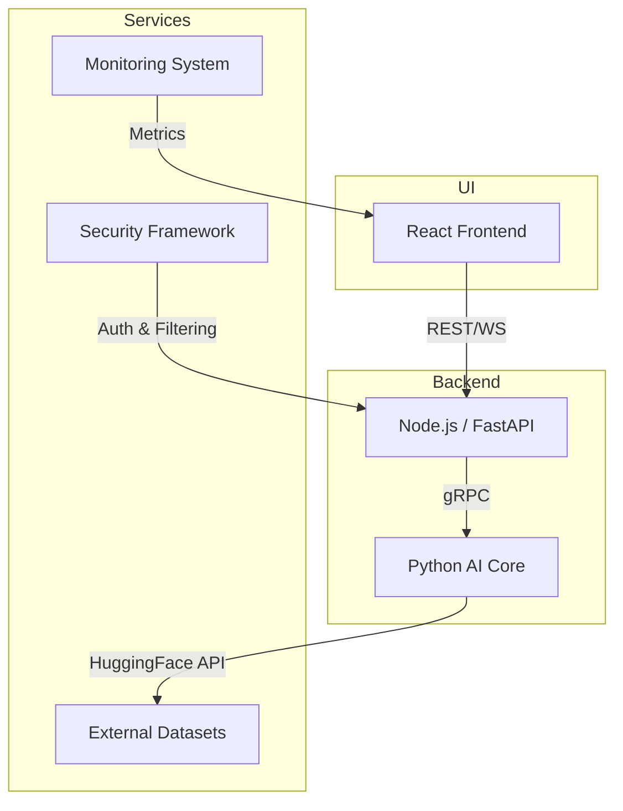

# EGen-V1.0 AI Model Training Platform

## 1. Overview
EGen-V1.0 is a next-generation AI model training and monitoring platform designed for developers and data scientists. Built on the EGen-D architecture, it provides:

- **Seamless model creation** via Python and a local Transformers fork.
- **Robust API layer** for session management and routing.
- **Intuitive React UI** for configuration, monitoring, and analytics.
- **Comprehensive security framework** with multi-stage filtering and role-based access.
- **Scalable monitoring system** for real-time performance metrics and alerting.

This document serves as a structured context for AI agents, outlining core components, workflows, and detailed modules.

---

## 2. Architecture



### 2.1 Component Responsibilities

| Component             | Technology           | Responsibility                                    |
|-----------------------|----------------------|---------------------------------------------------|
| **Frontend**          | React.js             | User interface, dashboards, data visualization    |
| **API Layer**         | Node.js / FastAPI    | Session management, routing, REST & WebSocket APIs|
| **AI Core**           | Python, PyTorch      | Model training, inference, fine-tuning            |
| **Monitoring System** | Python / React       | Metrics collection, analytics, alerting           |
| **Security Framework**| Python               | Authentication, content filtering, encryption     |

---

## 3. Key Modules

### 3.1 Model Development
Defines workflows for creating, fine-tuning, and exporting models.

- **Base Model Initialization**:
  - Scripted in Python using `transformers`.
  - Supports special tokens (`<context>`, `<response>`) and dynamic resizing of embeddings.
- **Fine-Tuning**:
  - Full & parameter-efficient fine-tuning.
  - Gradient accumulation for large-batch training.
- **Export & Packaging**:
  - Save in multiple formats (PyTorch, ONNX, TorchScript).
  - Versioning and artifact management.

### 3.2 Admin Interface
Web-based control panel for platform administration:

- **User & Role Management**:
  - Create/assign roles (Admin, Developer, Viewer).
  - OAuth, API Key, and JWT support.
- **Configuration**:
  - Global settings (e.g., default context window, token limits).
  - Security policies (rate limits, content filters).
- **Audit & Logs**:
  - Access logs, change history, security events.

### 3.3 Training Pipeline
End-to-end pipeline from data ingestion to evaluation:

1. **Data Ingestion**:
   - Upload via UI or CLI.
   - Support for CSV, JSONL, TFRecord.
2. **Preprocessing**:
   - Tokenization, normalization, data augmentation.
   - Customizable pipelines via plugins.
3. **Training**:
   - Distributed training with mixed precision.
   - Checkpointing and resume capabilities.
4. **Evaluation**:
   - Standard metrics (perplexity, accuracy, BLEU).
   - Custom metrics via callback hooks.

### 3.4 Monitoring System
Real-time tracking of model and system performance:

- **Metrics Collection**:
  - Latency, throughput, GPU/CPU usage, memory.
  - Request-level logs and error rates.
- **Dashboard**:
  - Interactive charts with filterable time ranges.
  - Alerting based on configurable thresholds.
- **Analytics**:
  - Usage patterns, cost estimation, SLA reports.

### 3.5 Security Framework
Ensures data and model integrity throughout the platform:

- **Authentication & Authorization**:
  - JWT, OAuth2, API keys.
  - Role-based access control (RBAC).
- **Content Filtering**:
  - Multi-stage filters (regex, ML-based toxicity).
  - Real-time request inspection.
- **Data Encryption**:
  - TLS for in-transit data.
  - AES-256 for at-rest storage.
- **Rate Limiting & Throttling**:
  - Per-user and per-endpoint limits.

---

## 4. UI & Styling

### 4.1 Theme System

```css
:root {
  --primary-bg: #1a1a1a;
  --secondary-bg: #2d2d2d;
  --accent: #4d8bf5;
  --text-primary: #e6e6e6;
}
[data-theme="light"] {
  --primary-bg: #f5f5f5;
  --secondary-bg: #ffffff;
  --text-primary: #2d2d2d;
}
```

### 4.2 Typography

| Element         | Font Family     | Size   | Weight |
|-----------------|-----------------|--------|--------|
| Headers         | Space Grotesk   | 2rem   | 700    |
| Body Text       | Inter           | 1rem   | 400    |
| Code Snippets   | Fira Code       | 0.9rem | 450    |

### 4.3 Design Principles
- Developer-centric with syntax highlighting.
- Adaptive layout with collapsible panels.
- Neumorphic UI elements.
- WCAG 2.1 AA accessibility compliance.

---

## 5. Getting Started

### 5.1 System Requirements
- **Python**: ≥3.7
- **Node.js**: ≥14
- **npm**
- **RAM**: ≥4 GB
- **Disk**: ≥10 GB free

### 5.2 Installation & Launch

#### Windows
```bash
launch.bat           # Start platform
launch.bat stop      # Stop services
launch.bat status    # Check status
launch.bat --help    # Help
launch.bat --dev-mode --debug --force  # Advanced
```

#### Linux/macOS
```bash
chmod +x start.sh
./start.sh           # Start platform
./start.sh --dev-mode --debug --force  # Advanced
```

### 5.3 Workflow
1. Initialize base model.
2. Start services.
3. Open UI at `http://localhost:3000`.
4. Upload datasets.
5. Configure training.
6. Launch training.
7. Monitor progress.
8. Export results.

---

## 6. Project Structure

```
egen-v1.0/
├── backend/        # FastAPI backend
├── frontend/       # React app
├── datasets/       # Sample & user data
├── monitoring/     # Metrics & analytics
├── docs/           # Documentation
├── start.sh        # Linux/macOS launcher
├── launch.bat      # Windows launcher
└── run_all.py      # Python orchestrator
```

---

## 7. Troubleshooting

| Problem                  | Solution                                      |
|--------------------------|-----------------------------------------------|
| Ports already in use     | `--force` for alternative ports               |
| Python not found         | Install Python ≥3.7 and add to PATH           |
| Services not starting    | Check logs with `--debug`                     |
| Frontend connection fails| Verify backend via `status`                   |

---

## 8. Implementation Roadmap

| Phase                      | Duration (Weeks) | Deliverables                               |
|----------------------------|------------------|--------------------------------------------|
| Phase 1: Core Setup        | 1–2              | Base model init, context mgmt, security    |
| Phase 2: UI & Training     | 3–4              | React UI, styling, training pipeline       |
| Phase 3: Monitoring        | 5–6              | Analytics dashboard, plugin architecture   |
| Phase 4: Testing & Optimize| 7–8              | Testing, perf. tuning, security hardening  |

---

## 9. Documentation
- **User Guide**: Step-by-step usage
- **API Reference**: Endpoint details
- **Developer Guide**: Architecture & extensions

---

## 10. License
Licensed under the **EGen License**. See `LICENSE` for details.


## Iteration Loop

To support continuous training and deployment, EGen-V1.0 follows a structured iteration loop with clear tasks, stages, and criteria:

### 1. Task Being Iterated
- **Data Preprocessing**: cleaning raw datasets, tokenization, augmentation, normalization.
- **Model Training**: executing training epochs, gradient accumulation, checkpointing.
- **Evaluation**: running validation suites, computing metrics (loss, accuracy, perplexity).
- **Deployment Simulation**: inference tests against sample inputs via API.

### 2. Current Stage
- **Stage Name**: e.g., `Training Epoch`, `Validation`, `Monitoring`, `Security Scan`.
- **Progress**: e.g., `Epoch 3/10`, `Validation Run 2/5`, `Security Audit Phase`.
- **Status Flags**: `In Progress`, `Paused`, `Completed`, `Failed`.

### 3. Success & Continuation Criteria
- **Data Preprocessing**: zero missing values, tokenization error rate < 0.1%.
- **Model Training**: validation loss decreases or remains within early stopping patience (3 epochs); gradient norms within threshold.
- **Evaluation**: primary metric (e.g., F1 score) ≥ 0.75; secondary metrics (perplexity ≤ 30).
- **Deployment Simulation**: average latency < 200 ms; error rate < 1%; throughput ≥ 50 req/s.
- **Monitoring**: no critical alerts; resource usage (CPU/GPU, memory) under 80%.

Each iteration advances only when its success criteria are met; failures trigger automatic rollback or manual review based on severity.

